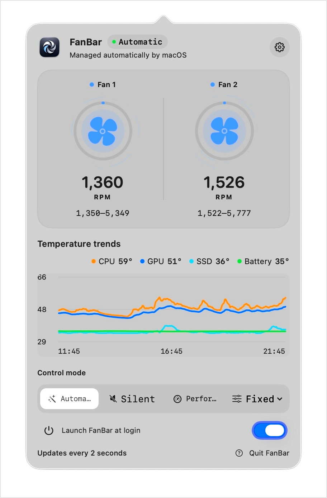
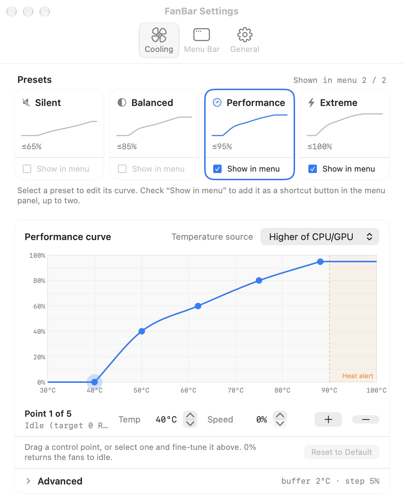
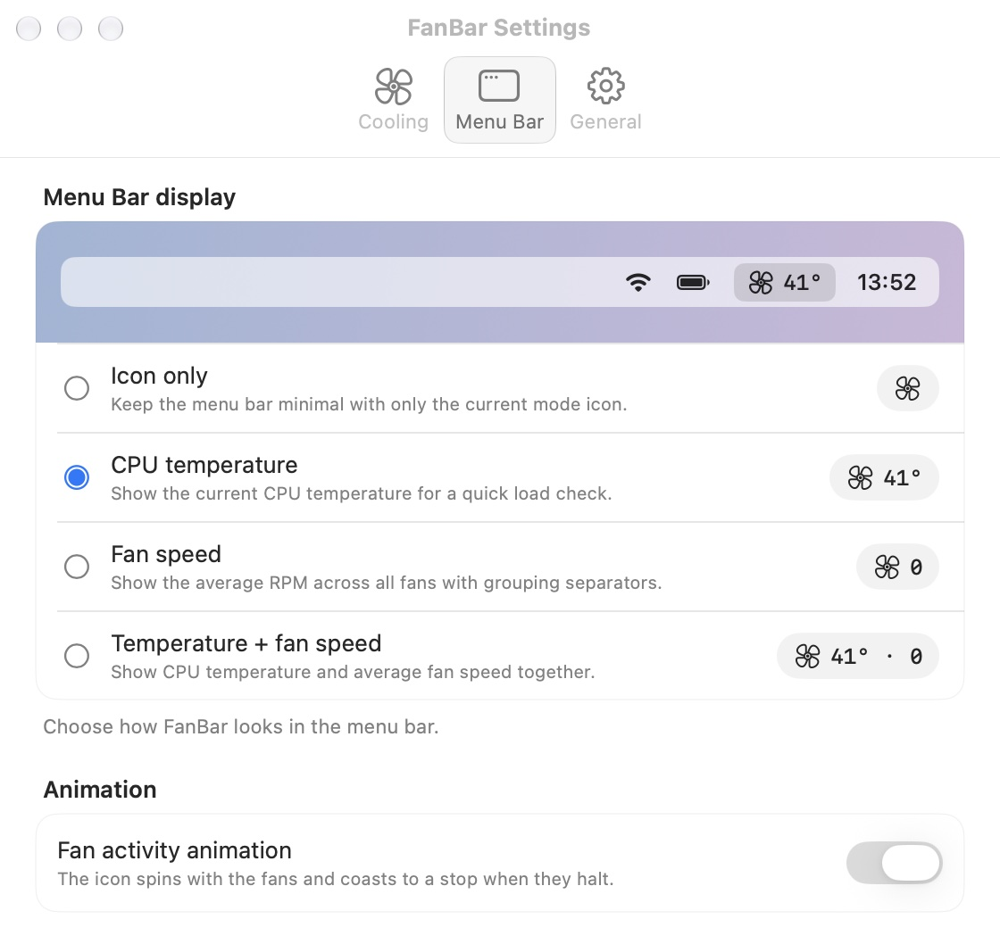
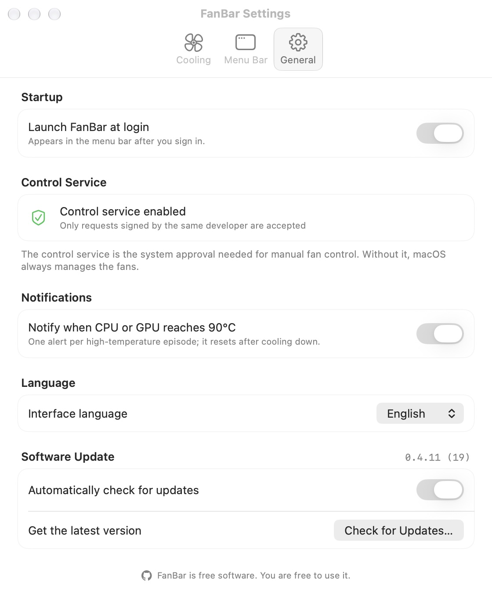

<div align="center">


# FanBar

> A native macOS menu-bar utility for reading temperatures and managing fan cooling when you need it.

<p align="center">
  <a href="README.md"><strong>English</strong></a> ·
  <a href="README.zh-CN.md">简体中文</a> ·
  <a href="README.zh-TW.md">繁體中文</a> ·
  <a href="README.ja.md">日本語</a>
</p>

<p align="center">
  <a href="LICENSE">
    
  </a><!--
  --><a href="https://github.com/helson-lin/FanBar/releases/latest">
    
  </a><!--
  --><a href="https://github.com/helson-lin/FanBar/releases">
    
  </a><!--
  --><a href="https://github.com/helson-lin/FanBar/releases">
    
  </a><!--
  --><a href="https://github.com/helson-lin/FanBar/stargazers">
    
  </a>
</p>

<p align="center">
  <a href="#-screenshots">Screenshots</a> •
  <a href="#-highlights">Highlights</a> •
  <a href="#️-download">Download</a> •
  <a href="#-usage">Usage</a> •
  <a href="#️-build-and-run">Build</a> •
  <a href="#️-architecture">Architecture</a> •
  <a href="#-continuous-integration-and-releases">Releases</a> •
  <a href="#-report-an-issue">Issues</a>
</p>

</div>

FanBar supports macOS 11 Big Sur and later on Apple Silicon Macs and Intel Macs that expose readable AppleSMC fan data. It keeps everyday use safe and quiet with macOS automatic management, while making manual control available only after the signed control service is approved.

## 📸 Screenshots

English interface. Switch to Simplified Chinese, Traditional Chinese, or Japanese from **Settings → General → Interface language** without restarting.



Settings opens on the Cooling tab. Each panel preset has its own editable temperature→RPM curve.



Appearance chooses the menu bar icon and what the status item shows, previewed live in a simulated menu bar.



General covers login item, control-service status, high-temperature notifications, language, and Sparkle updates.



## ✨ Highlights

- **At-a-glance status** — Show the menu-bar icon, CPU temperature, average fan RPM, or both — side by side or stacked to save menu bar width.
- **Six menu bar icons** — Choose Swirl, Ringed, Bold, Propeller, Guard, or Outline; all are optically matched to system icons, and the hub turns solid while FanBar controls the fans.
- **Desktop widget** — On macOS 14 or later, add FanBar to the desktop to see average RPM, per-fan speeds, CPU temperature, and control mode. WidgetKit refreshes are system-scheduled and are not second-by-second.
- **Live visualization** — Monitor CPU/GPU temperatures plus SSD and battery temperatures when the Mac exposes them, with a rolling ten-minute chart and airflow motion that follows actual RPM.
- **Multiple cooling modes** — Restore macOS automatic control, set a target RPM, or choose the Silent, Balanced, Performance, or Extreme panel preset.
- **Smart temperature curves** — Each panel preset has its own editable curve that smoothly adjusts fan output from chip temperature.
- **Selectable temperature source** — Use CPU, GPU, or SSD temperature for curve control; unavailable sensors trigger the existing safe fallback.
- **High-temperature notifications** — Opt in to macOS notifications when CPU or GPU reaches 90°C; each sustained high-temperature episode alerts once and re-arms after cooling down.
- **Safe fallback** — Targets are clamped to each fan's reported hardware range. On quit, disconnect, or service failure, FanBar attempts to restore macOS automatic control.
- **Native authorization flow** — First-run guidance explains why the control service is needed and opens the correct macOS settings page.
- **Four languages** — English, 简体中文, 繁體中文, and 日本語, or follow the system language.

## ⬇️ Download

The latest notarized build is on the [GitHub Releases](https://github.com/helson-lin/FanBar/releases/latest) page:

| Chip | File |
|:--|:--|
| Apple Silicon | `FanBar-<version>-arm64.dmg` |
| Intel | `FanBar-<version>-x86_64.dmg` |
| Universal (Sparkle updates use this) | `FanBar-<version>.dmg` |

### Install with Homebrew

With [Homebrew](https://brew.sh) installed, add this repository as a tap and install:

```sh
brew tap helson-lin/fanbar https://github.com/helson-lin/FanBar.git
brew install --cask helson-lin/fanbar/fanbar
```

The cask installs the signed, notarized universal app for Apple Silicon and Intel
into `/Applications`. Launch FanBar and approve its control service to enable fan
control. If you already installed FanBar manually, quit it and move the existing
`/Applications/FanBar.app` to the Trash before installing through Homebrew.

FanBar can update itself through Sparkle. To upgrade explicitly with Homebrew:

```sh
brew update
brew upgrade --cask helson-lin/fanbar/fanbar
```

To uninstall, quit FanBar first, then run:

```sh
brew uninstall --cask helson-lin/fanbar/fanbar
```

Add `--zap` to also remove saved preferences and caches. Homebrew may request an
administrator password to unload the fan-control service.

### Requirements

- macOS 11 Big Sur or later
- A Mac that exposes fan data through AppleSMC
- Xcode 26 and Swift 6 for local builds

> [!WARNING]
> AppleSMC is an undocumented hardware interface. Lowering fan speed can increase temperature; sustained high speed can increase noise, power use, and mechanical wear. Use manual control only when you understand the trade-offs, and prefer Automatic or Smart cooling for normal use.

## 🚀 Usage

1. Launch FanBar and read the current temperature and fan speeds from the menu bar.
2. To control fans, choose **Enable fan control** and follow the macOS authorization prompt.
3. Choose a panel preset or fixed RPM from the popover. Use **Automatic** at any time to return control to macOS.

Fixed RPM and panel presets can restore macOS control after 15 minutes, 30 minutes, or one hour.

On macOS 14 or later, open the Notification Center widget editor and add **FanBar**. The widget displays the latest snapshot published by the main app; WidgetKit controls refresh timing, so use the menu-bar popover when you need second-level telemetry.

### Change the interface language

Open **Settings → General → Interface language** and choose:

- **System** — follow the Mac's current language (Simplified or Traditional Chinese, Japanese, otherwise English)
- **English**
- **简体中文**
- **繁體中文**
- **日本語**

The setting is shared by the menu-bar popover, settings window, onboarding flow, status messages, helper errors, and the desktop widget.

## 🐛 Report an issue

Before submitting, search [existing issues](https://github.com/helson-lin/FanBar/issues). Then [choose an issue form](https://github.com/helson-lin/FanBar/issues/new/choose) for a bug, feature request, or usage question. Bug reports should include the FanBar version, macOS version, Mac model, and steps to reproduce. Please remove personal information from screenshots and logs.

## 🛠️ Build and run

Clone the repository, then build a local app bundle:

```sh
zsh scripts/generate-icons.sh
FANBAR_SIGN_IDENTITY=- zsh scripts/package-app.sh
open dist/FanBar.app
```

`FANBAR_SIGN_IDENTITY=-` uses an ad-hoc signature for local testing. For distribution, replace it with a valid Developer ID Application identity.

### Create a local DMG

```sh
FANBAR_SIGN_IDENTITY=- zsh scripts/build-dmg.sh
```

The default output is `dist/FanBar-<version>.dmg`. To build a specific architecture:

```sh
FANBAR_ARCHS=arm64 FANBAR_APP_OUTPUT=dist/FanBar-arm64.app \
  FANBAR_SIGN_IDENTITY=- zsh scripts/package-app.sh
FANBAR_DMG_OUTPUT=dist/FanBar-arm64.dmg zsh scripts/build-dmg.sh dist/FanBar-arm64.app

FANBAR_ARCHS=x86_64 FANBAR_APP_OUTPUT=dist/FanBar-x86_64.app \
  FANBAR_SIGN_IDENTITY=- zsh scripts/package-app.sh
FANBAR_DMG_OUTPUT=dist/FanBar-x86_64.dmg zsh scripts/build-dmg.sh dist/FanBar-x86_64.app
```

Verify a DMG's signature, architecture, and installation structure with:

```sh
zsh scripts/test-dmg.sh dist/FanBar-0.4.3.dmg
```

## 🏗️ Architecture

FanBar separates the UI from privileged writes:

```text
FanBar.app → privileged XPC → FanBarHelper (root) → AppleSMC
```

The helper does not expose arbitrary SMC writes. It only supports reading fans, setting a bounded target/preset/fraction, and restoring automatic control. macOS 13 and later use `SMAppService`; macOS 11–12 use a compatible launchd registration path.

## 📦 Continuous integration and releases

FanBar uses Sparkle 2 for online updates. The stable feed is the `appcast.xml`
asset in the latest GitHub Release. Every update must pass Developer ID,
notarization, and FanBar's independent EdDSA signature verification.

Store Apple notarization credentials once on the release Mac:

```sh
xcrun notarytool store-credentials FanBar-notary \
  --apple-id "your Apple ID" \
  --team-id "64S5F787T9"
```

After committing an updated `CFBundleShortVersionString` and increasing
`CFBundleVersion` on `main`, publish locally with:

```sh
gh auth login -h github.com
FANBAR_NOTARY_PROFILE=FanBar-notary zsh scripts/release-local.sh
```

The local release command requires a clean `main` checkout and performs the
universal2 build plus separate `arm64` and `x86_64` DMGs, signing,
notarization, DMG verification, checksums, signed appcast, Git tag, and
GitHub Release upload. Existing releases are preserved by default; use
`--replace-assets` only for an intentional retry.

The Sparkle private key is stored in the login Keychain under the `FanBar`
account. Do not regenerate it after the first release because installed clients
must keep trusting the same public key. CI releases also require the exported
private key in the `SPARKLE_PRIVATE_KEY` GitHub Actions secret.

GitHub Actions validates universal2 builds on pushes and pull requests. Local
publishing is the default. To opt into tag-triggered CI publishing, set the
repository variable `FANBAR_PUBLISH_FROM_CI=true` and configure
`SPARKLE_PRIVATE_KEY` plus the other release secrets. Do not enable CI publishing
while using the local release command.

When CI publishing is enabled, push a tag matching the app version:

```sh
git tag -a v0.4.3 -m "FanBar 0.4.3"
git push origin v0.4.3
```

### Update the Homebrew cask

After publishing a stable release (locally or from CI), download and hash its
universal DMG, then submit the resulting cask change in a PR:

```sh
python3 scripts/update-homebrew-cask.py          # Latest stable release
# Or: python3 scripts/update-homebrew-cask.py v0.4.14
```

The script requires Python 3 and an authenticated `gh` CLI. It rejects drafts,
prereleases, and releases missing the universal DMG. Merge `Casks/fanbar.rb` into
`main` to make the new version available through `brew update`. The Homebrew CI
workflow checks cask style, the download checksum, installation, and removal.

## ⭐ Star History

<div align="center">

[](https://star-history.com/#helson-lin/FanBar&Date)

</div>

## 🙏 Acknowledgements and license

Copyright © 2024–2026 Jarin He. FanBar's source code is licensed under the [GNU General Public License v3.0](LICENSE).

You may use, modify, and redistribute FanBar—including commercially—as long as you comply with the GPL-3.0: keep the copyright and license notices, and release the source of any distributed modified version under the same license.

**Name and icon are excluded.** The "FanBar" name and the FanBar icon/logo are not covered by the GPL-3.0 license. If you distribute a modified version, you must rename it and replace the icon so it cannot be confused with the official FanBar.

The Apple Silicon control sequence references the MIT-licensed [`agoodkind/macos-smc-fan`](https://github.com/agoodkind/macos-smc-fan). See [THIRD_PARTY_NOTICES.md](THIRD_PARTY_NOTICES.md) for complete third-party attribution.

Thanks to these people for reporting bugs and helping make FanBar better:

<table>
  <tr>
    <td align="center">
      <br>
      <sub><b>倾藏</b></sub>
    </td>
    <td align="center">
      <br>
      <sub><b>一撒撒一撒</b></sub>
    </td>
    <td align="center">
      <br>
      <sub><b>Taolela</b></sub>
    </td>
  </tr>
</table>
