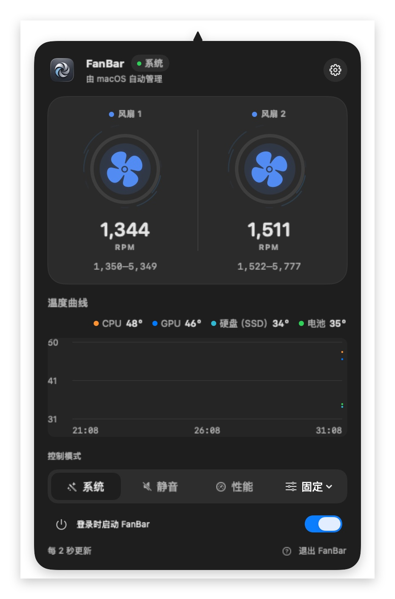

# FanBar

> 原生 macOS 菜单栏风扇控制器：看得到温度，也能在需要时精细管理散热策略。

[English](README.md) · [简体中文](README.zh-CN.md)

FanBar 支持 macOS 11 Big Sur 及更高版本，适用于 Apple Silicon 与仍提供可读 AppleSMC 风扇数据的 Intel Mac。日常使用保持 macOS 自动管理，只有在用户批准签名控制服务后才开放手动调速。

## 截图

以下截图展示简体中文界面。FanBar 同时支持英文，可以在 **设置 → 语言** 中切换，修改会立即生效。




## 亮点

- **一眼掌握状态**：菜单栏可显示图标、CPU 温度、平均风扇 RPM 或组合信息。
- **实时可视化**：查看 CPU/GPU 温度；设备支持时同时显示 SSD 与电池温度，并提供近十分钟趋势和随 RPM 变化的气流动画。
- **多种散热方式**：恢复自动控制、设定目标 RPM，或使用静音、均衡、性能、极速面板预设。
- **智能温控曲线**：每个面板预设都有独立曲线，按芯片温度平滑调速，可在设置中分别编辑。
- **温度来源可选**：温控曲线支持 CPU、GPU 或硬盘（SSD）温度作为控制来源；设备未提供对应传感器时会保持安全回退。
- **高温通知**：可在设置中开启 CPU/GPU 高温通知，达到 90°C 时发送 macOS 通知；同一次高温只提醒一次，降温后会重新提醒。
- **安全回退**：转速始终限制在硬件报告范围内；退出、断连或服务异常时尽力恢复系统自动控制。
- **原生授权流程**：首次使用会解释控制服务用途，并自动打开正确的 macOS 设置页面。
- **中英文界面**：可在设置中选择系统语言、English 或简体中文。

## 系统要求

- macOS 11 Big Sur 或更高版本
- 一台能被 AppleSMC 读取到风扇数据的 Mac
- 如需自行构建：Xcode 26 与 Swift 6

> [!WARNING]
> SMC 是 Apple 未公开支持的硬件接口。降低转速可能导致过热；持续高转速可能增加噪音、功耗与机械磨损。请只在理解风险的前提下启用手动控制，并优先使用“自动”或“智能温控”。

## 使用方式

1. 启动 FanBar 后，从菜单栏查看当前温度和风扇转速。
2. 需要手动控制时，选择“启用风扇控制”，并按系统提示完成授权。
3. 从菜单栏选择面板预设或固定转速；完成后可随时恢复“自动”模式。

固定转速和面板预设支持在 15 分钟、30 分钟或 1 小时后自动恢复 macOS 管理，避免忘记关闭手动控制。

### 切换界面语言

打开 **设置 → 语言**，可选择：

- **System**：跟随 Mac 当前语言（中文或英文）
- **English**：英文界面
- **简体中文**：中文界面

语言设置会同步应用到菜单栏面板、设置窗口、首次使用引导、状态消息和控制服务错误提示。

## 构建与运行

克隆仓库后，执行以下命令生成一个仅用于本机测试的应用包：

```sh
zsh scripts/generate-icons.sh
FANBAR_SIGN_IDENTITY=- zsh scripts/package-app.sh
open dist/FanBar.app
```

`FANBAR_SIGN_IDENTITY=-` 会使用 ad-hoc 签名，适合本地构建验证。发布时请替换为有效的 Developer ID Application 签名身份。

### 创建本地 DMG

```sh
FANBAR_SIGN_IDENTITY=- zsh scripts/build-dmg.sh
```

默认产物为 `dist/FanBar-<version>.dmg`。架构构建、签名和 DMG 验证方式请参考 [English README](README.md) 中的 Build and run 小节。

## 架构

FanBar 将界面与特权写入操作分开：

```text
FanBar.app → privileged XPC → FanBarHelper (root) → AppleSMC
```

Helper 不提供任意 SMC 写入接口，只支持查询、固定/预设/按比例设置，以及恢复自动控制。macOS 13+ 使用 `SMAppService` 管理服务；macOS 11–12 使用兼容的 launchd 注册流程。

## 持续集成与发布

FanBar 使用 Sparkle 2 检查和安装在线更新。稳定更新源为 GitHub Release 中的
`appcast.xml`；更新包必须同时通过 Developer ID、公证和 FanBar 专用 EdDSA
签名验证。

本机首次配置 Apple 公证凭据：

```sh
xcrun notarytool store-credentials FanBar-notary \
  --apple-id "你的 Apple ID" \
  --team-id "64S5F787T9"
```

将 `CFBundleShortVersionString` 和递增的 `CFBundleVersion` 提交到 `main` 后，执行：

```sh
gh auth login -h github.com
FANBAR_NOTARY_PROFILE=FanBar-notary zsh scripts/release-local.sh
```

本地发布脚本要求工作区干净且位于 `main`，会依次完成 universal2 构建、签名、
公证、DMG 验证、校验和、签名 Appcast、Git 标签和 GitHub Release 上传。已有
Release 默认不会被覆盖；仅在明确重试时使用 `--replace-assets`。

Sparkle 私钥保存在登录钥匙串的 `FanBar` 账户中。首次发布后不要重新生成该密钥，
否则已安装版本无法验证后续更新。CI 发布还需将导出的私钥保存为
`SPARKLE_PRIVATE_KEY` GitHub Actions secret。

GitHub Actions 同样会在推送和 Pull Request 时验证 universal2 构建。本地发布是
默认方式；如果要改由标签触发 CI 发布，需要设置仓库变量
`FANBAR_PUBLISH_FROM_CI=true`，并配置 `SPARKLE_PRIVATE_KEY` 等 Release secrets。
不要同时启用 CI 发布和运行本地发布脚本。

启用 CI 发布模式后，推送与 App 版本匹配的标签：

```sh
git tag -a v0.4.1 -m "FanBar 0.4.1"
git push origin v0.4.1
```

## 致谢与许可

Apple Silicon 的控制序列参考了 MIT 许可的 [`agoodkind/macos-smc-fan`](https://github.com/agoodkind/macos-smc-fan)。完整的第三方归属见 [THIRD_PARTY_NOTICES.md](THIRD_PARTY_NOTICES.md)。
