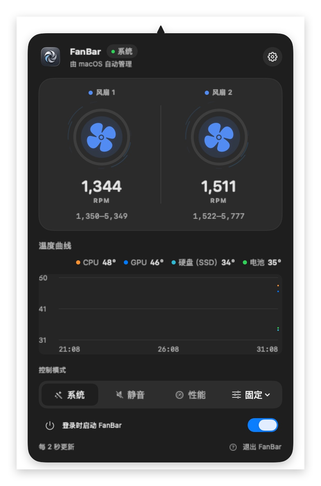
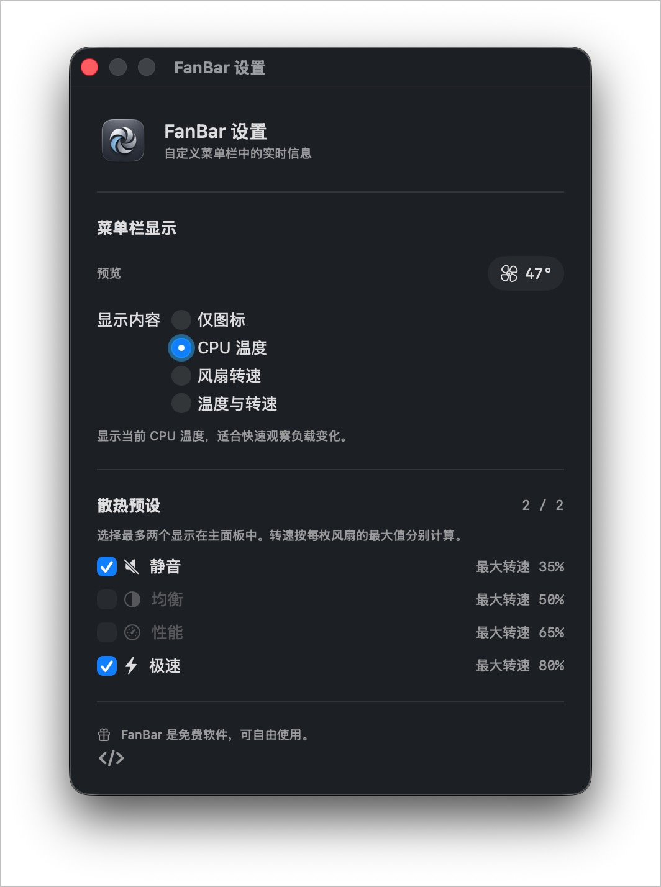

<div align="center">


# FanBar

> 原生 macOS 菜单栏风扇控制器：看得到温度，也能在需要时精细管理散热策略。

<p align="center">
  <a href="README.md">English</a> ·
  <a href="README.zh-CN.md"><strong>简体中文</strong></a> ·
  <a href="README.zh-TW.md">繁體中文</a> ·
  <a href="README.ja.md">日本語</a>
</p>

<p align="center">
  <a href="LICENSE">
    
  </a><!--
  --><a href="https://github.com/helson-lin/FanBar/releases/latest">
    
  </a><!--
  --><a href="https://github.com/helson-lin/FanBar/releases">
    
  </a><!--
  --><a href="https://github.com/helson-lin/FanBar/releases">
    
  </a><!--
  --><a href="https://github.com/helson-lin/FanBar/stargazers">
    
  </a>
</p>

<p align="center">
  <a href="#-截图">截图</a> •
  <a href="#-亮点">亮点</a> •
  <a href="#️-下载">下载</a> •
  <a href="#-使用方式">使用方式</a> •
  <a href="#️-构建与运行">构建</a> •
  <a href="#️-架构">架构</a> •
  <a href="#-持续集成与发布">发布</a> •
  <a href="#-反馈问题">反馈</a>
</p>

</div>

FanBar 支持 macOS 11 Big Sur 及更高版本，适用于 Apple Silicon 与仍提供可读 AppleSMC 风扇数据的 Intel Mac。日常使用保持 macOS 自动管理，只有在用户批准签名控制服务后才开放手动调速。

## 📸 截图

以下为深色外观下的简体中文界面。可在 **设置 → 通用 → 界面语言** 中切换到英文、繁体中文或日语，无需重启。



设置默认打开「散热」页。每个面板预设都有独立的温度→转速曲线，可直接拖锚点编辑。



## ✨ 亮点

- **一眼掌握状态**：菜单栏可显示图标、CPU 温度、平均风扇 RPM 或组合信息；组合信息可并排显示，也可上下排列以节省菜单栏宽度。
- **六款菜单栏图标**：漩涡、环形、粗体、螺旋桨、护罩、线条可选，均与系统图标做了光学对齐；由 FanBar 控制风扇时图标中心变为实心。
- **实时可视化**：查看 CPU/GPU 温度；设备支持时同时显示 SSD 与电池温度，并提供近十分钟趋势和随 RPM 变化的气流动画。
- **桌面组件** — macOS 14 及更高版本可将 FanBar 风扇组件添加到桌面，查看平均 RPM、各风扇转速、CPU 温度和控制模式；组件由系统调度刷新，不保证秒级实时。
- **多种散热方式**：恢复自动控制、设定目标 RPM，或使用静音、均衡、性能、极速面板预设。
- **智能温控曲线**：每个面板预设都有独立曲线，按芯片温度平滑调速，可在设置中分别编辑。
- **温度来源可选**：温控曲线支持 CPU、GPU 或硬盘（SSD）温度作为控制来源；设备未提供对应传感器时会保持安全回退。
- **高温通知**：可在设置中开启 CPU/GPU 高温通知，达到 90°C 时发送 macOS 通知；同一次高温只提醒一次，降温后会重新提醒。
- **安全回退**：转速始终限制在硬件报告范围内；退出、断连或服务异常时尽力恢复系统自动控制。
- **原生授权流程**：首次使用会解释控制服务用途，并自动打开正确的 macOS 设置页面。
- **四种界面语言**：English、简体中文、繁體中文、日本語，也可跟随系统语言。

## ⬇️ 下载

最新已公证版本见 [GitHub Releases](https://github.com/helson-lin/FanBar/releases/latest)：

| 芯片 | 文件 |
|:--|:--|
| Apple Silicon | `FanBar-<version>-arm64.dmg` |
| Intel | `FanBar-<version>-x86_64.dmg` |
| Universal（Sparkle 在线更新使用） | `FanBar-<version>.dmg` |

### 通过 Homebrew 安装

安装 [Homebrew](https://brew.sh) 后，将本仓库添加为 tap 并安装：

```sh
brew tap helson-lin/fanbar https://github.com/helson-lin/FanBar.git
brew install --cask helson-lin/fanbar/fanbar
```

Cask 会把已签名、公证的通用版应用安装到 `/Applications`，同时支持 Apple Silicon
和 Intel。启动 FanBar 后，按提示批准控制服务即可调节风扇。如果此前已手动安装，
请先退出 FanBar，并将已有的 `/Applications/FanBar.app` 移到废纸篓，再通过 Homebrew 安装。

FanBar 仍可通过 Sparkle 自动更新；也可以明确使用 Homebrew 升级：

```sh
brew update
brew upgrade --cask helson-lin/fanbar/fanbar
```

卸载前先退出 FanBar，然后运行：

```sh
brew uninstall --cask helson-lin/fanbar/fanbar
```

添加 `--zap` 可同时删除偏好设置和缓存。卸载风扇控制服务时，Homebrew 可能要求输入管理员密码。

### 系统要求

- macOS 11 Big Sur 或更高版本
- 一台能被 AppleSMC 读取到风扇数据的 Mac
- 如需自行构建：Xcode 26 与 Swift 6

> [!WARNING]
> SMC 是 Apple 未公开支持的硬件接口。降低转速可能导致过热；持续高转速可能增加噪音、功耗与机械磨损。请只在理解风险的前提下启用手动控制，并优先使用“自动”或“智能温控”。

## 🚀 使用方式

1. 启动 FanBar 后，从菜单栏查看当前温度和风扇转速。
2. 需要手动控制时，选择“启用风扇控制”，并按系统提示完成授权。
3. 从菜单栏选择面板预设或固定转速；完成后可随时恢复“自动”模式。

固定转速和面板预设支持在 15 分钟、30 分钟或 1 小时后自动恢复 macOS 管理，避免忘记关闭手动控制。

在 macOS 14 及更高版本中，打开通知中心的组件编辑器，搜索并添加 **FanBar**。组件展示主应用最近发布的风扇快照；WidgetKit 的刷新频率由 macOS 决定，因此需要秒级实时数据时仍应使用菜单栏面板。

### 切换界面语言

打开 **设置 → 通用 → 界面语言**，可选择：

- **System**：跟随 Mac 当前语言（简体中文、繁体中文、日语，其他语言显示英文）
- **English**：英文界面
- **简体中文**：简体中文界面
- **繁體中文**：繁体中文界面（台湾用语）
- **日本語**：日语界面

语言设置会同步应用到菜单栏面板、设置窗口、首次使用引导、状态消息、控制服务错误提示和桌面组件。

## 🐛 反馈问题

提交前请先搜索[已有 Issue](https://github.com/helson-lin/FanBar/issues)，再通过 [Issue 表单](https://github.com/helson-lin/FanBar/issues/new/choose)选择问题反馈、功能建议或使用问题。反馈 bug 时请提供 FanBar 版本、macOS 版本、Mac 型号及复现步骤；上传截图或日志前请移除个人信息。

## 🛠️ 构建与运行

克隆仓库后，执行以下命令生成一个仅用于本机测试的应用包：

```sh
zsh scripts/generate-icons.sh
FANBAR_SIGN_IDENTITY=- zsh scripts/package-app.sh
open dist/FanBar.app
```

`FANBAR_SIGN_IDENTITY=-` 会使用 ad-hoc 签名，适合本地构建验证。发布时请替换为有效的 Developer ID Application 签名身份。

### 创建本地 DMG

```sh
FANBAR_SIGN_IDENTITY=- zsh scripts/build-dmg.sh
```

默认产物为 `dist/FanBar-<version>.dmg`。架构构建、签名和 DMG 验证方式请参考 [English README](README.md) 中的 Build and run 小节。

## 🏗️ 架构

FanBar 将界面与特权写入操作分开：

```text
FanBar.app → privileged XPC → FanBarHelper (root) → AppleSMC
```

Helper 不提供任意 SMC 写入接口，只支持查询、固定/预设/按比例设置，以及恢复自动控制。macOS 13+ 使用 `SMAppService` 管理服务；macOS 11–12 使用兼容的 launchd 注册流程。

## 📦 持续集成与发布

FanBar 使用 Sparkle 2 检查和安装在线更新。稳定更新源为 GitHub Release 中的
`appcast.xml`；更新包必须同时通过 Developer ID、公证和 FanBar 专用 EdDSA
签名验证。

本机首次配置 Apple 公证凭据：

```sh
xcrun notarytool store-credentials FanBar-notary \
  --apple-id "你的 Apple ID" \
  --team-id "64S5F787T9"
```

将 `CFBundleShortVersionString` 和递增的 `CFBundleVersion` 提交到 `main` 后，执行：

```sh
gh auth login -h github.com
FANBAR_NOTARY_PROFILE=FanBar-notary zsh scripts/release-local.sh
```

本地发布脚本要求工作区干净且位于 `main`，会依次完成 universal2 构建、独立的
`arm64` / `x86_64` DMG、签名、公证、DMG 验证、校验和、签名 Appcast、Git
标签和 GitHub Release 上传。已有 Release 默认不会被覆盖；仅在明确重试时使用
`--replace-assets`。

Sparkle 私钥保存在登录钥匙串的 `FanBar` 账户中。首次发布后不要重新生成该密钥，
否则已安装版本无法验证后续更新。CI 发布还需将导出的私钥保存为
`SPARKLE_PRIVATE_KEY` GitHub Actions secret。

GitHub Actions 同样会在推送和 Pull Request 时验证 universal2 构建。本地发布是
默认方式；如果要改由标签触发 CI 发布，需要设置仓库变量
`FANBAR_PUBLISH_FROM_CI=true`，并配置 `SPARKLE_PRIVATE_KEY` 等 Release secrets。
不要同时启用 CI 发布和运行本地发布脚本。

启用 CI 发布模式后，推送与 App 版本匹配的标签：

```sh
git tag -a v0.4.3 -m "FanBar 0.4.3"
git push origin v0.4.3
```

### 更新 Homebrew Cask

通过本地脚本或 CI 发布稳定版后，运行以下命令下载通用 DMG、计算校验和，并将生成的
Cask 变更提交为 PR：

```sh
python3 scripts/update-homebrew-cask.py          # 最新稳定版
# 或：python3 scripts/update-homebrew-cask.py v0.4.14
```

脚本需要 Python 3 和已登录的 `gh` CLI，会拒绝草稿、预发布版本及缺少通用 DMG 的版本。
将 `Casks/fanbar.rb` 合并到 `main` 后，用户即可通过 `brew update` 获取新版。
Homebrew CI 会检查 Cask 格式、下载校验和、安装和卸载。

## ⭐ Star 趋势

<div align="center">

[](https://star-history.com/#helson-lin/FanBar&Date)

</div>

## 🙏 致谢与许可

Copyright © 2024–2026 Jarin He。FanBar 源代码采用 [GNU 通用公共许可证 v3.0（GPL-3.0）](LICENSE) 授权。

你可以使用、修改和再分发 FanBar（包括商业用途），但须遵守 GPL-3.0：保留版权与许可声明，并以相同许可证公开所分发修改版本的源代码。

**名称与图标不在授权范围内。**「FanBar」名称及 FanBar 图标/Logo 不属于 GPL-3.0 的授权范围。分发修改版本时必须更改名称并替换图标，以免与官方 FanBar 混淆。

Apple Silicon 的控制序列参考了 MIT 许可的 [`agoodkind/macos-smc-fan`](https://github.com/agoodkind/macos-smc-fan)。完整的第三方归属见 [THIRD_PARTY_NOTICES.md](THIRD_PARTY_NOTICES.md)。

感谢以下朋友反馈 bug，帮助 FanBar 变得更好：

<table>
  <tr>
    <td align="center">
      <br>
      <sub><b>倾藏</b></sub>
    </td>
    <td align="center">
      <br>
      <sub><b>一撒撒一撒</b></sub>
    </td>
    <td align="center">
      <br>
      <sub><b>Taolela</b></sub>
    </td>
  </tr>
</table>
